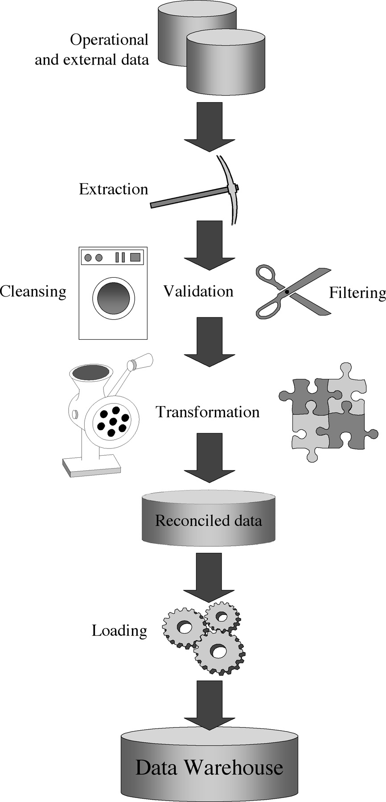
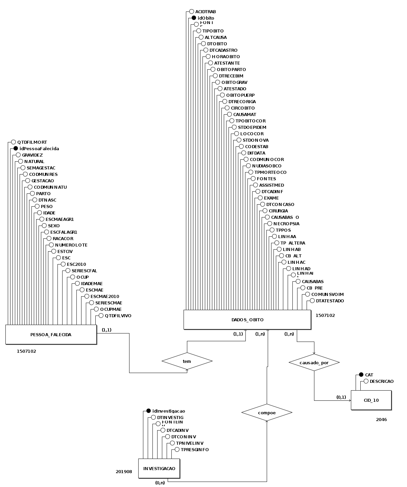
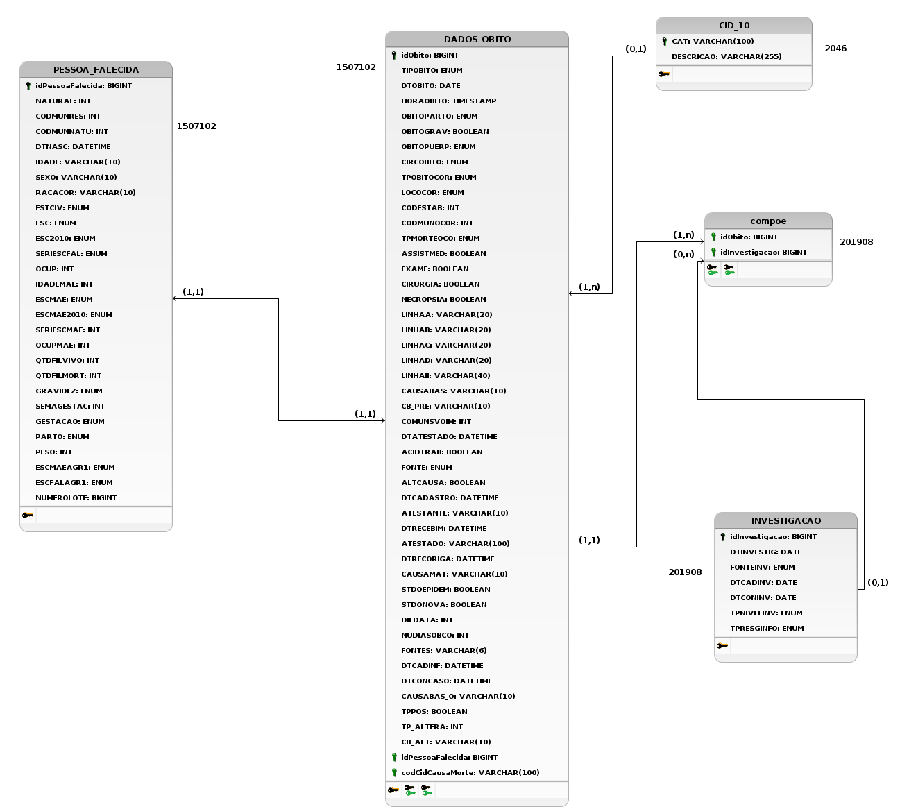

ETL é a sigla para as operações de _extract, transform, load_, que combinam dados de múltiplas fontes em um
conjunto consistente armazenado em um armazém de dados ou outro sistema de destino. Esse processo é essencial para projetos de armazém de dados_ e fornece a base para análise de dados e aprendizado de máquina.

O processo de ETL (Figura 1) consiste em três etapas, sendo a primeira a **extração**, copiando ou exportando dados de diversas origens para uma área de _staging_, que pode incluir servidores SQL ou NoSQL, arquivos, email e páginas web. Em seguida, ocorre a **transformação**, que envolve processar e consolidar os dados para o uso desejado. As tarefas podem incluir filtragem,
limpeza, validação, cálculos, edição de texto, conversão de unidades de medida e formatação de dados em tabelas
compatíveis com o armazém de dados de destino. A última etapa é o **carregamento** dos dados no armazém de dados
de destino, sendo geralmente automatizado e pode incluir uma carga inicial de todos os dados processados, seguida por
carregamentos periódicos de alterações e, com menor frequência, recarregamento completo dos dados.

A etapa de transformação dos dados é uma das mais cruciais em armazéns de dados, já que estes sistemas visam melhorar a qualidade dos dados armazenados. Os seguintes a seguir são frequentes nos dados obtidos na fase de extração, e o processo de limpeza dos dados visa solucioná-los, geralmente por meio de ferramentas específicas para ETL, que fornecem funcionalidades para a retificação e homogeneização dos dados.

- Dados duplicados;
- Inconsistência de dados;
- Dados ausentes;
- Uso indevido de campos - como, por exemplo, um telefone armazenado em um campo de documento de CPF;
- Valores impossíveis ou errados - como, por exemplo, uma data 30/02/1997;
- Valores inconsistentes entre entidades por convenções diferentes - como, por exemplo, uma entidade com o campo UF preenchido como "DF" e outra como "Distrito Federal";
- Valores inconsistentes por erros de digitação.

As principais atividades da transformação de dados para a conversão dos dados em um formato específico para o armazém de dados, que objetiva estabelecer um mapeamento entre os dados de entrada e os dados do destino, são:

- Conversão e normalização nas duas pontas dos dados, fonte e destino, para unificar formatos e unidades de medida;
- Mapeamento, para associar os campos equivalentes nas fontes e no destino;
- Seleção, que reduz o número de campos nas fontes.

Figura 1: Processo de ETL. Fonte: [1]

## Objetivos e Exemplos de Uso

O processo de ETL combina dados de diferentes fontes em um armazenamento de dados único e consistente, que é carregado em um armazém de dados ou outro sistema de destino, é um dos principais métodos de processamento de dados. Esse processo é frequentemente utilizado por organizações em processos de:

- **Extração de dados de sistemas legados**: a junção de bases de dados de sistemas legados pode se tornar um processo trabalhoso, pois estes sistemas muitas vezes utilizam versões anteriores dos sistemas gerenciadores de bancos de dados, armazenam dados em formatos diferentes e geralmente contém dados duplicados, como por exemplo os dados do [Sistema de Informação sobre Mortalidade](#base-de-dados), escolhido para a realização do trabalho, que contém diversas colunas para o registro da escolaridade da pessoa falecida e seus familiares, em detrimento da mudança de legislação sobre o ensino básico, em 2010, que alterou a nomenclatura e quantidade de séries do ensino fundamental de 8 para 9 séries.
- **Limpeza de dados para melhorar qualidade e prover consistência**: a duplicação de dados e armazenamento de dados derivados, dentre outras causas, podem gerar inconsistência nos dados, o que dificulta a análise dos dados da maneira correta, podendo mascarar interferências entre dados.
- **Carregamento de dados em bancos de dados**: comumente é necessário inicializar uma base de dados com valores já existentes, porém não formatados, processo que pode ser facilitado e automatizado com ferramentas ETL.

De forma geral, o processo de ETL é essencial para o tratamento e correção de dados provenientes de fontes diferentes e ou suscetíveis a erros, um exemplo prático é o tratamento dos dados sobre clientes em lojas, que geralmente são inseridos no momento do pagamento, situação em que existe uma probabilidade de erros de digitação, por exemplo.

## Ferramentas e Aplicações

Inicialmente as organizações escreviam seus próprios códigos ETL para resolver problemas específicos, mas atualmente estão disponíveis ferramentas ETL de código livre ou comerciais no mercado. Tais soluções, geralmente, incluem recursos como a **automação abrangente**, **suporte para gerenciamento de dados complexos**, **segurança e conformidade**, além de apresentarem-se em interfaces de fácil uso, de forma que o profissional de dados possa focar mais nas operações realizadas e menos em código e implementação manual de scripts.

Dentre as ferramentas disponíveis, algumas das de código aberto mais utilizadas são:

1. [Apache NiFi](https://nifi.apache.org/): Uma ferramenta de integração de dados de fluxo contínuo, desenvolvida pela Apache Software Foundation. Ela permite extrair, transformar e carregar dados de forma fácil e escalável, com uma interface visual intuitiva e recursos avançados.
1. [Pentaho Data Integration](https://sourceforge.net/projects/pentaho/): Também conhecido como Kettle, é uma solução ETL de código aberto da Pentaho. Ele fornece recursos completos de extração, transformação e carregamento de dados, juntamente com recursos avançados de orquestração e agendamento.
1. [CloverDX](https://www.cloverdx.com/): Uma plataforma de integração de dados escalável e flexível, oferecendo recursos de ETL e transformação de dados. Ela suporta uma ampla variedade de fontes de dados e possui uma interface gráfica intuitiva para a criação de fluxos de trabalho de ETL.
1. [Apache Airflow](https://airflow.apache.org/): Embora seja mais conhecido como uma ferramenta de orquestração de fluxo de trabalho, o Apache Airflow também pode ser usado para tarefas de ETL. Ele permite definir e agendar fluxos de trabalho de ETL complexos, oferecendo extensibilidade e escalabilidade.

## Vantagens e Desvantagens

O processo de ETL melhora a qualidade dos dados ao realizar a limpeza e tratamento antes de inserir em um outro repositório, possui um grande repertório de ferramentas disponíveis, de fácil uso e bem documentadas, mas pode tornar-se um processo demorado e trabalhoso a depender do volume de dados e quantidade de atualizações subsequentes. Em situações com repositórios maiores ou maior número de atualizações, recomenda-se a utilização de outras técnicas, como o ELT (_Extract, Load, Transform_) ou CDC (Captura de Dados de Mudança).

## Base de Dados

### Fontes de Dados

A base de dados que passará pelo processo de ETL durante a execução do trabalho combina indicadores sobre a mortalidade no Brasil, no ano de 2022. A escolha foi motivada pela relevância dos dados, uma vez que estes são os dados mais recentes, no portal de dados abertos do SUS, na data corrente. Nesta base estão presentes, dentre outros, os dados relativos à causa de morte, localidade e dados censitários do falecido. Tais dados são essenciais para a geração de informações como índice de mortalidade por faixa etária, acompanhamento do nível de violência nas diversas regiões do país e determinação das doenças mais letais em brasileiro, sendo todas essas informações relevantes durante a criação de políticas públicas de segurança e saúde.

A base de dados está disponível no sítio [OpenDataSUS](https://opendatasus.saude.gov.br/dataset/sim) no [formato CSV](https://opendatasus.saude.gov.br/dataset/sim/resource/9ade641a-1f25-40d9-b55b-cff7096eb5b4) (_Comma separated values_) além de sua documentação no formato de [dicionário de dados](https://opendatasus.saude.gov.br/dataset/sim/resource/b894426e-83dc-4703-91f8-fe90d9b7f8f0). Após uma análise da documentação da base de dados, é possível concluir que os dados disponibilizados são provenientes de fontes diferentes (Figura \ref{origem-dd})

Figura 2: Documentação da coluna "ORIGEM" da tabela. Fonte: [3]

A tabela cujos dados estão disponíveis possui 87 colunas, mas para a execução do trabalho optou-se pela criação de novas entidades e relacionamentos, visando diminuir a quantidade de redundância e aumentar a integridade dos dados armazenados. Além disso, foi possível identificar colunas repetidas, em detrimento das diferentes fontes de dados e alterações nas legislações brasileiras, como por exemplo as colunas indicando a escolaridade do falecido. Para atribuir maior legilibidade aos dados, serão utilizados os dados das CIDs (Classificação Internacional de Doenças) [disponibilizados pelo DataSus](http://www2.datasus.gov.br/cid10/V2008/descrcsv.htm).

### Documentação da Base de Dados

O Diagrama Entidade Relacionamento visa representar graficamente as entidades e relacionamentos presentes na modelagem. A partir dos dados provenientes das [duas fontes](#fontes-de-dados) definidas, foram identificadas as entidades e relacionamentos representadas na Figura 3.

Figura 3: Diagrama Entidade Relacionamento (DER). Fonte: Autoria própria.

A partir das informações contidas no [Dicionário de Dados [3]](#referência-bibliográfica) e nos dados armazenados na base foi possível determinar os tipos de dados armazenados. Dando início à etapa de limpeza dos dados, as colunas duplicadas foram removidas e os tipos de dados foram alterados para fornecer uma melhor adequação e análise posterior.

Figura 4: Diagrama Lógico de Dados (DLD). Fonte: Autoria própria.

## Referência Bibliográfica

[1] GOLFARELLI M., RIZZI S. Data Warehouse Design: Modern Principles and Methodologies. 1.ª edição. Nova York, McGraw Hill, 2009.

[2] What is ETL? — Artigo no site da IBM, disponível em <https://www.ibm.com/topics/etl>. Acesso em 12 de junho de 2023.

[3] Sistema de Informação sobre Mortalidade – SIM, disponível em <https://opendatasus.saude.gov.br/dataset/sim>. Acesso em 12 de junho de 2023.

[4] Arquivos em Formato CSV - CID-10, disponível em <http://www2.datasus.gov.br/cid10/V2008/descrcsv.htm>. Acesso em 12 de junho de 2023.

[5] Apache NiFi, **Apache NiFi**. Disponível em <https://nifi.apache.org/>. Acesso em 12 de junho de 2023.

[6] Pentaho Data Integration, **Pentaho Data Integration**. Disponível em <https://sourceforge.net/projects/pentaho/>. Acesso em 12 de junho de 2023.

[7] CloverDX, **CloverDX**. Disponível em <https://www.cloverdx.com/>. Acesso em 12 de junho de 2023.

[8] Apache Airflow, **Apache Airflow**. Disponível em <https://airflow.apache.org/>. Acesso em 12 de junho de 2023.
