# Apache Nifi

## Construindo o Fluxo

Os dados utilizados no exemplo vêm de duas fontes:

- Arquivo de dados sobre os CIDs [1], disponível na pasta data, da raiz do repositório.
- [Dados sobre a mortalidade, em 2020](https://diaad.s3.sa-east-1.amazonaws.com/sim/Mortalidade_Geral_2020.csv) [2]

### Fluxo para os dados de CID

#### Extract

Para o arquivo, utilizamos o processador **GetFile** do Apache Nifi, com a seguinte configuração:

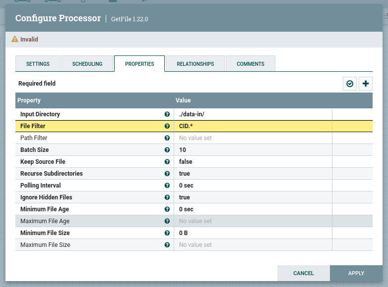

- O Input Directory contém o caminho relativo a pasta `/opt/nifi/nifi-current/data-in` do container, observe que a
  pasta `data-in`  está em um _bind_ com a pasta local: [data](./data), por meio da configuração
  no `docker-compose`:

```yaml
volumes:
  - "./data:/opt/nifi/nifi-current/data-in"  
```

> O filtro por nome foi inserido para que o processador não recupere outros arquivos da pasta. Durante o período de testes recomenda-se utilizar a propriedade "Keep Source File" como `true`, para que o arquivo original não seja deletado após o processamento.

O processador GetFile tem uma saída possível, presente na aba "Relationships", e ficará no estado inválido até que as
saídas sejam tratadas.

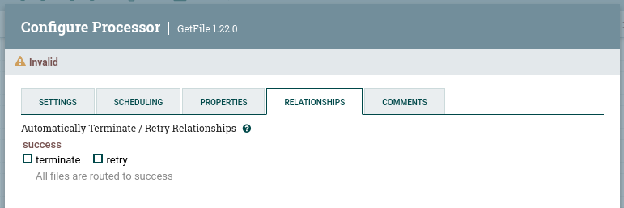

Como a saída desse processador será o arquivo `CSV` lido, o próximo processador será responsável por fazer a leitura
desse arquivo CSV e separá-lo em arquivos contendo apenas um registro, já no formato `JSON`. Para isso, o processador *
*SplitRecord** será utilizado, para ligar os dois processadores basta passar o mouse por cima do primeiro e quando a
seta representada na figura abaixo aparecer, arrastar o mouse até o segundo processador.

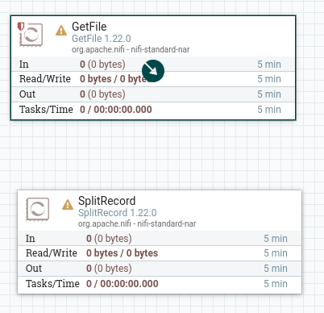

A seguir, será solicitada a configuração da conexão, onde a saída em caso de `sucess` do primeiro processador
(**GetFile**) será direcionada para o processador **SplitRecord**.

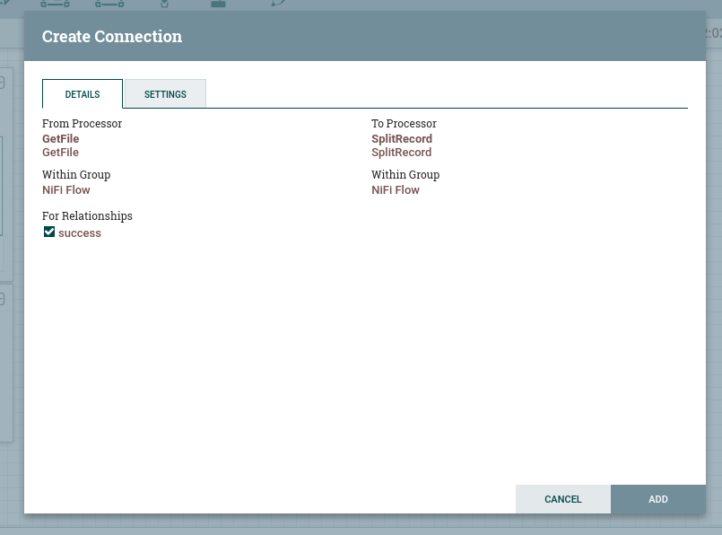

Nesse momento será criada uma fila (_queue_) entre os processadores, onde será possível acompanhar o estado do fluxo de
dados.

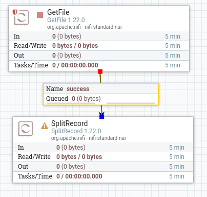

> Observe que o processador **GetFile** agora está no estado válido, mas ainda não foi iniciado, e o processador *
*SplitRecord** está no estado inválido.

Para verificar o funcionamento do processador GetFile ele será executado apenas uma vez, para isso clique com o botão
direito do mouse sobre o processador e selecione a opção **Run Once**:


Após a execução, o arquivo lido (1 arquivo de 26.42 KB) entrará para a fila, aguardando a entrada no próximo
processador:

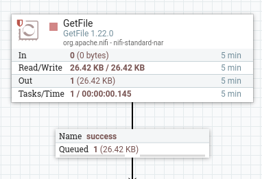

É possível verificar os arquivos na fila selecionando a opção **List Queue** da fila:

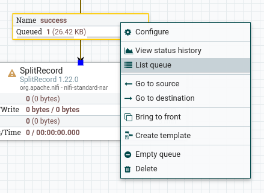


#### Transform

O processador **SplitRecord** contém a primeira etapa da transformação dos dados, a transformação de `CSV` para `JSON`,
para isso ele utilizará dois serviços, um de leitura CSV e outro de escrita JSON. Esses serviços devem ser configurados
de forma global para o fluxo, para isso clique em um espaço vazio do fluxo e selecione a opção **Configure**.

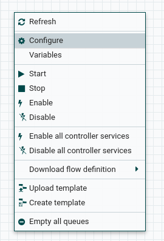

Na aba **controller services** selecione a opção para adicionar um novo serviço, e busque por **CSVReader**.


Clique no ícone de engrenagem para configurar o leitor e nas propriedades altere as seguintes configurações:

| Configuração               | Valor                          | Descrição                                                    |
| -------------------------- | ------------------------------ | ------------------------------------------------------------ |
| Schema Access Strategy     | Use Strings Fields From Header | Determina como os nomes das propriedades serão determinados. |
| Value Separator            | ;                              | Separador de registros, no caso do arquivo usado é ';'.      |
| Treat First Line as Header | true                           | Auto explicativo.                                            |

Para ativar o serviço, clique no ícone de raio e no botão "Enable" da tela que aparecer.

Repita os passos anteriores para adicionar os serviços de leitura e escrita em JSON: **JsonRecordSetWriter** e **JsonTreeReader**. Não é necessário alterar nenhuma configuração.

Agora que os serviços de leitura e escrita estão criados e habilitados, é possível inseri-los na configuração do **SplitRecord**.


O processador SplitRecord tem 3 saídas possíveis, e é necessário direcioná-las ou configurá-las como finais, na aba relationships.

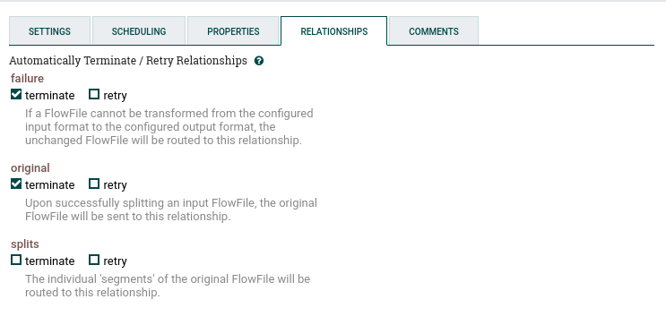

A saída splits será direcionada para o próximo processador, para o tratamento dos dados por meio de um script python, o **ExecuteScript**.

Configure o processador da seguinte maneira:


Observe que a pasta [scripts](../scripts/) está em um bind com a pasta `/opt/nifi/nifi-current/scripts` do container, por meio da configuração do docker-compose. O script `cid10_format_json.py` é responsável pelo seguinte processamento:

```python title="format_json.python" linenums="1"
--8<--
cid10_format_json.py
--8<--
```

Após o processamento, cada arquivo encontra-se no seguinte estado, estando pronto para a inserção na base de dados.


O processador responsável pela conversão de JSON para SQL é o **ConvertJSONtoSQL**, como o próprio nome sugere, que necessita de uma **JDBC Connection Pool** para funcionar, portanto é necessário criá-la junto com os serviços de leitura e escrito criados anteriormente.

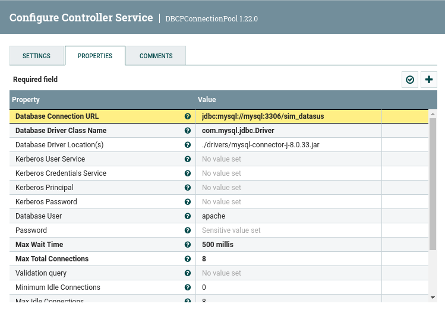

> A senha para o usuário apache também deve ser inserida, não aparecendo na imagem por ser um dado sensível.
> O usuário apache também deve ser criado no banco de dados, caso não existe, e ter acesso aos objetos da base `sim_datasus`.

Uma vez criada a _pool_ de conexões, basta configurar o processador da seguinte maneira:
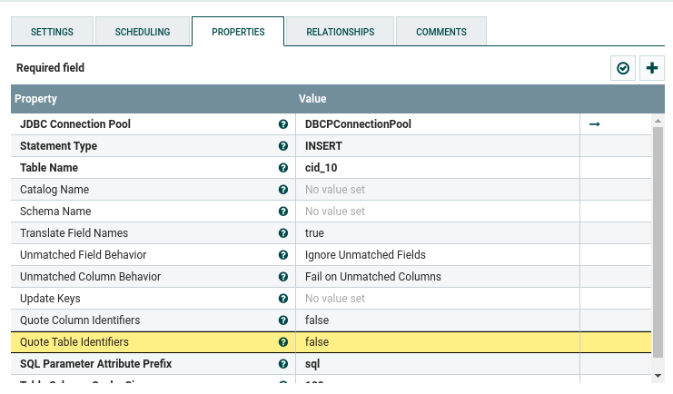

#### Load

Por fim, a inserção dos dados é feita com auxílio do processador **ExecuteSQL**, que irá executar os arquivos sql gerados pelo processador anterior. Basta configurar a _connection pool_ e os _relationships_ como terminais.


Quantidade de tuplas antes da inserção:


Após a inserção:

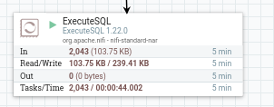


#### Overview

Fluxo completo:

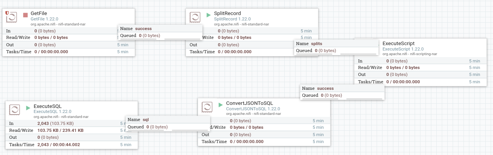

## Referências

[1] Arquivos em Formato CSV - CID-10, disponível em <http://www2.datasus.gov.br/cid10/V2008/descrcsv.htm>. Acesso em 12
de junho de 2023.

[2] Sistema de Informação sobre Mortalidade – SIM, disponível em  <https://opendatasus.saude.gov.br/dataset/sim>. Acesso
em 12 de junho de 2023.

[3] Exemplo de Script Jython, disponível em <https://gist.github.com/ijokarumawak/1df6d34cd1b2861eb6b7432ee7245ccd>

[4] <https://www.youtube.com/watch?v=cHElJ8M5g0Y&ab_channel=InsightByte>
