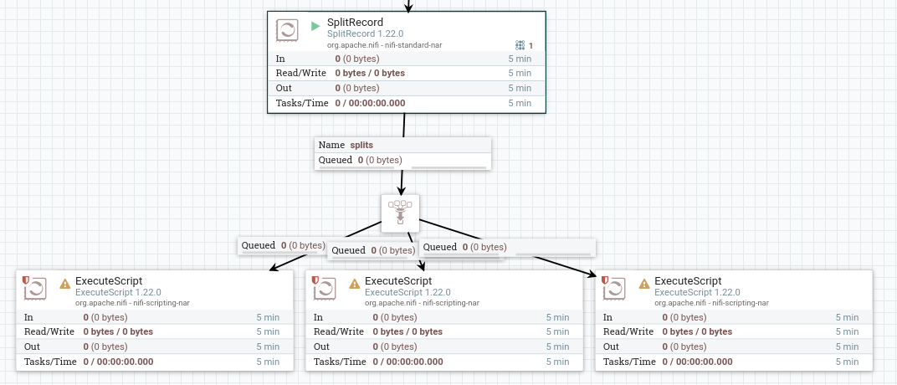

### Fluxo para os dados de Mortalidade do SIM

#### Extract

O processador utilizado será responsável por fazer a requisição para o site que hospeda os arquivos CSV com os dados do SIM, sistema de informações sobre mortalidade, do SUS.

O nome deste processador é **InvokeHTTP**, e nas suas configurações basta alterar a HTTP URL para o link da fonte de dados: <https://diaad.s3.sa-east-1.amazonaws.com/sim/Mortalidade_Geral_2020.csv>

#### Transform

Em seguida, o processador SplitRecords é utilizado para fazer a conversão dos dados de CSV para JSON. O mesmo processador utilizado no processo para o [CID](./index.md) pode ser copiado e utilizado novamente.

Diferentemente do processo do [CID](./index.md), no processo para os dados sobre mortalidade serão geradas três tabelas, conforme documentado no [DER](./contexto.md#documentação-da-base-de-dados), portanto a saída será redirecionada para três processadores, com auxílio da ferramenta **Funnel**, conforme ilustra a figura:



Cada script será responsável pela transformação dos dados relativos a uma das tabelas.

##### Metadados Sistema

Constam na tabela principal alguns dados de controle do sistema, portanto, foi criada uma nova entidade para armazenar esses dados.

```sql title="fisico.sql" linenums="1"
--8<--
fisico.sql:metadados
--8<--
```

O script responsável por fazer esse tratamento é:

```python title="format_metadados.py" linenums="1"
--8<--
sim_format_metadados.py
--8<--
```

##### Investigação

O mesmo vale para os dados de investigação.

```sql title="fisico.sql" linenums="1"
--8<--
fisico.sql:investigacao
--8<--
```

O script responsável por fazer esse tratamento é:

```python title="sim_format_investigacao.py" linenums="1"
--8<--
sim_format_investigacao.py
--8<--
```

##### Pessoa Falecida

O mesmo vale para os dados de pessoa falecida.

```sql title="fisico.sql" linenums="1"
--8<--
fisico.sql:pessoa_falecida
--8<--
```

O script responsável por fazer esse tratamento é:

```python title="sim_format_dados_pessoa_falecida.py" linenums="1"
--8<--
sim_format_dados_pessoa_falecida.py
--8<--
```

##### Óbito

O mesmo vale para os dados de óbito.

```sql title="fisico.sql" linenums="1"
--8<--
fisico.sql:obito
--8<--
```

O script responsável por fazer esse tratamento é:

```python title="sim_format_obito.py" linenums="1"
--8<--
sim_format_obito.py
--8<--
```
